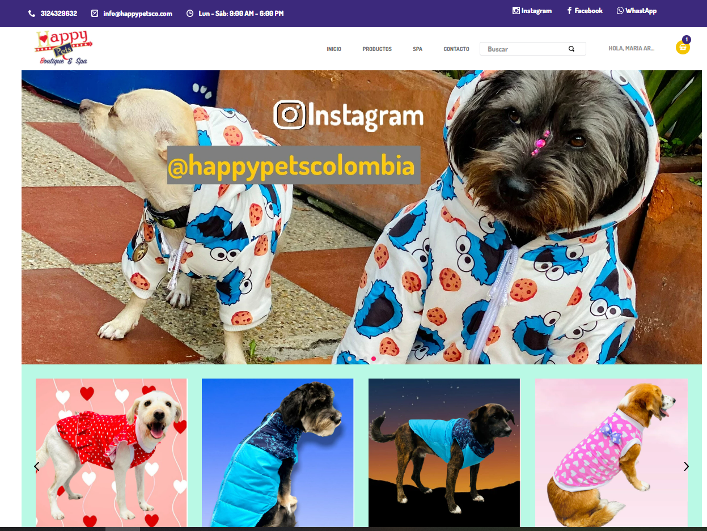

# Clon de tienda  Hapyy  Pets Co

Vtex-StorePets es un clon de la tienda oficial   [ Happy PetsCo](https://www.happypetsco.com/)

**Preview**




## Configuración

### Paso 1 - Configuración Básica

Acceda a la guía de configuración básica de [VTEX IO](https://developers.vtex.com/vtex-developer-docs/docs/vtex-io-documentation-2-basicsetuptodevelopinvtexio) y siga todos los pasos indicados.

Al final de la configuración, debe tener instalada la interfaz de línea de comandos de VTEX (Toolbelt) junto con un espacio de trabajo de desarrollador en el que puede trabajar.

### Paso 2 - Clonación del repositorio

[Clone](https://help.github.com/en/github/creating-cloning-and-archiving-repositories/cloning-a-repository) este repositorio en sus archivos locales para poder comenzar a trabajar en él de manera efectiva.

Luego, acceda al directorio del repositorio usando su terminal.

### Paso 3 - Editar el Manifest.json

Una vez en el directorio del repositorio, es hora de editar el `manifest.json` del Minimum Boilerplate.

Una vez en el archivo, debes remplazar los valores de `vendor` y `account`. `vendor` es el nombre de la cuenta que estas trabajando, nuestro partner y `account` es el nombre que elijas para tu tienda. Por ejemplo:

```json
{
  "vendor": "vtexstore",
  "name": "my-pets-store",
}
```

### Paso 4 - Instalar apps necesarias

Con el fin de utilizar Store Framework y trabajar en el tema de su tienda, es necesario tener instalados `vtex.store-sitemap` y `vtex.store`.

Ejecutar `vtex list`, para comprobar si esas aplicaciones ya están instaladas.

Si no lo están, ejecute el siguiente comando para instalarlos: `vtex install vtex.store-sitemap vtex.store -f`

### Paso 5 - Desinstalar el store-theme predeterminado

Ejecutando `vtex list`, puede verificar si cualquier tema está instalado.

Es común tener ya un `vtex.store-theme` instalado cuando se inicia el proceso de desarrollo de la tienda.

Por lo tando, si lo encuentras en la lista de la aplicación, copie el nombre y usar junto con el comando `vtex uninstall`. Por ejemplo:

```json
vtex uninstall vtex.store-theme
```

### Paso 6 - Ejecute un preview de la tienda

Siempre asegurarse de donde estammos trabajando, ya que, debemos evitar trabajar en master. para esto, utilice el comando `vtex whoami` Entonces ha llegado el momento de subir todos los cambios que hizo en sus archivos locales a la plataforma. Para eso, use el comando `vtex link`.

Si el proceso se ejecuta sin errores, el siguiente mensaje aparecerá: `App linked successfully`. Entonces, ejecute el comando `vtex browse` para abrir una ventana del navegador que tiene su tienda vinculada en ella.

Esto le permitirá ver los cambios aplicados en tiempo real, a través de la cuenta y el espacio de trabajo en el que está trabajando.

### Builders 

    "styles": "2.x",
    "store": "0.x",
    "docs": "0.x",
    "assets": "0.x"
###  Dependencies


    "vtex.store": "2.x",
    "vtex.store-header": "2.x",
    "vtex.product-summary": "2.x",
    "vtex.store-footer": "2.x",
    "vtex.store-components": "3.x",
    "vtex.styleguide": "9.x",
    "vtex.slider": "0.x",
    "vtex.carousel": "2.x",
    "vtex.shelf": "1.x",
    "vtex.menu": "2.x",
    "vtex.minicart": "2.x",
    "vtex.product-details": "1.x",
    "vtex.product-kit": "1.x",
    "vtex.search-result": "3.x",
    "vtex.login": "2.x",
    "vtex.my-account": "1.x",
    "vtex.flex-layout": "0.x",
    "vtex.rich-text": "0.x",
    "vtex.store-drawer": "0.x",
    "vtex.locale-switcher": "0.x",
    "vtex.product-quantity": "1.x",
    "vtex.product-identifier": "0.x",
    "vtex.product-specification-badges": "0.x",
    "vtex.product-review-interfaces": "1.x",
    "vtex.telemarketing": "2.x",
    "vtex.order-placed": "2.x",
    "vtex.stack-layout": "0.x",
    "vtex.tab-layout": "0.x",
    "vtex.responsive-layout": "0.x",
    "vtex.slider-layout": "0.x",
    "vtex.iframe": "0.x",
    "vtex.breadcrumb": "1.x",
    "vtex.sticky-layout": "0.x",
    "vtex.add-to-cart-button": "0.x",
    "vtex.store-image": "0.x",
    "vtex.store-link": "0.x",
    "vtex.store-icons": "0.x",
    "vtex.search": "2.x",
    "vtex.product-list": "0.x",
    "vtex.checkout-summary": "0.x",
    "vtex.disclosure-layout": "1.x",
    "vtex.product-price": "1.x",
    "vtex.modal-layout": "0.x",


### Custom Apps (Componentes que deben instalarse en la tienda) 

    "itgloberspartnercl.whatsapp-button": "0.x",
    "itgloberspartnercl.bullets-diagramation": "0.x",
   
### Contributors

  - Maria Elena Arroyo
